# Hi, I'm Jeksen 👋

### Full-Stack Software Engineer · AI Automation & Agentic Systems

📍 Based in **Medan, Indonesia** · Open to remote & contract opportunities.

  
  &nbsp;
  
  &nbsp;
  
  &nbsp;
  

 

<!-- Side-by-side terminal: ASCII Portrait + Activity Stats -->
<table>
  <tr>
    <td valign="top" width="50%">
      
    </td>
    <td valign="top" width="50%">
      
    </td>
  </tr>
</table>

<!-- Live Animated Contribution Heatmap -->

 
 

---

### Current Focus & Roles

- **Frontend Developer** @ **Universitas Mikroskil**  
  Developing intuitive and robust academic web platforms using **Vue.js**, **Nuxt**, and **Next.js**.

- **Founder** @ **ShadowPrice**  
  The pricing intelligence layer built for **Claude**, **Cursor**, and any **MCP-compatible AI Agent**.

- **AI & Agentic Workflows**  
  Designing intelligent automation pipelines, LLM tool-calling integrations, and autonomous engineering workflows.

- **Exploring Opportunities**  
  Actively open to remote engineering roles and collaborative ventures.
